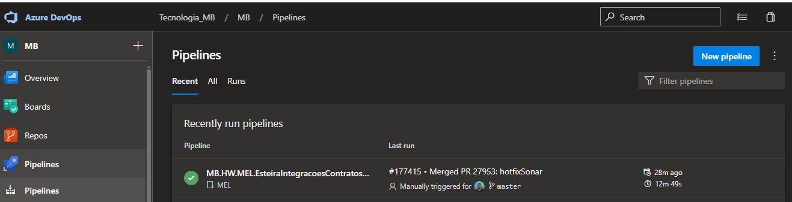
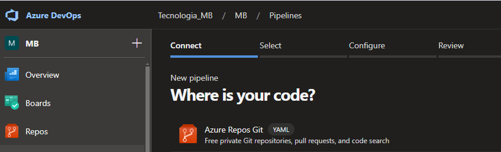
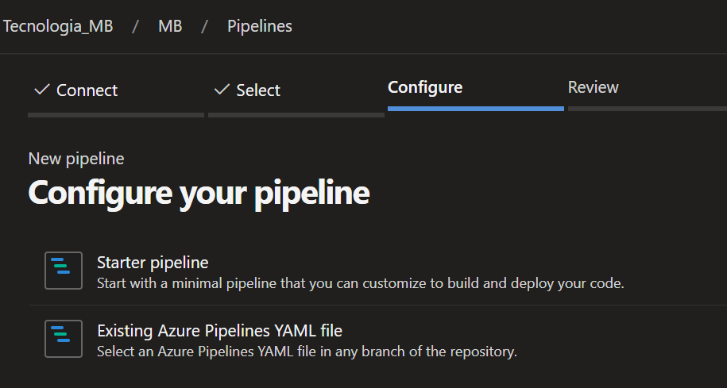
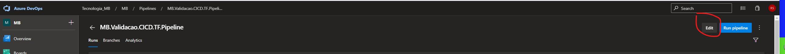
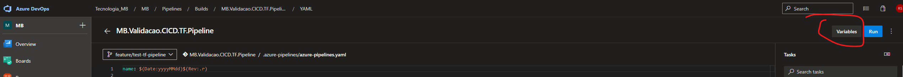
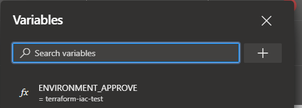
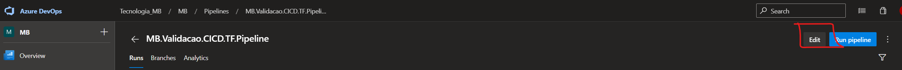
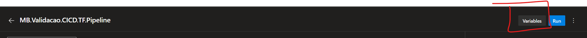

# Terraform Template

1.	Introdução
2.	Objetivos da documentação
3.	Detalhamento e explicação do desenvolvimento
4.  Criação do Environment para a aprovação do deploy
5.  Detalhamento das variáveis de ambiente

# 1 Introdução
Este documento descreve as configurações desse template para pipeline de Terraform. Iremos descrever os objetivos e os benefícios
de ter esse template de pipeline construído.

# 2 Objetivos
O objetivo desse documentação é descrever e documentar a escrita desse template, o que e como foi pensado.

## Benefícios

* Um lugar único e centralizado de pipeline, isso facilita a manutenção. Um exemplo, se tivermos 200 pipelines, se precisarmos alterar algo 
no pipeline, é necessário entrar em repositório por repositório para alterar, o que levaria muito tempo. Dessa forma, do pipeline como template,
caso seja necessário alterar algo, se altera no template e isso vai ficar valendo para todos os pipelines.
* Governança
* Segurança

# 3 Detalhamento e explicação do desenvolvimento

O template é dividido em pequenas partes, divididos em folders, para facilitar o re-uso e manutenção.

O pipeline principal está em resources/pipeline-tf-template.yaml. 
Esse é o pipeline que será "chamado" no template. 

Mais abaixo, será explicado como configurar a chamada para esse arquivo na criação de novos pipelines.
Mas vamos por enquanto focar no conteúdo desse arquivo.

```
parameters:
- name: terraform_choice
  type: string
  default: apply
  
trigger:
- main

variables:
- template: ../variables/variables-azurePipelines.yaml

stages:
- template: ../stages/terraform/stage-plan.yaml@pipelines
  parameters: 
    terraform_choice: ${{ parameters.terraform_choice}}
- template: ../stages/terraform/stage-apply.yaml@pipelines
```

Você pode notar que existe um parâmetro com o nome de "terraform_choice". Esse parãmetro é uma escolha que o usuário terá que fazer ao executar o pipeline.
Ele recebe como parâmetro os valores de "apply" ou "destroy"

A trigger é qual branch o pipeline irá executar automaticamente após uma alteração no código, seja realizando um merge de um PR ou caso tenha permissão, um commit direto 
na branch "main".

Em variables, é onde fica o arquivo de variáveis "comuns" entre os projetos, como por exemplo, agent_pool.

Em stages, é onde começam as configurações.
Primeiramente é chamado o template stage-plan.yaml, que é o stage que realiza o plano do Terraform (terraform plan).

Ao visualizar o arquivo ../stages/terraform/stage-plan.yaml, você verá que ele fará referência a outro arquivo, e assim por diante,
pois os arquivos estão dividos nas folders: tasks, jobs, resources, scripts, etc..

# Como fazer para criar o pipeline apontando para esse template

Abaixo vamos descrever os passos necessários para a configuração do pipeline.

Obs: O ideal e recomendado é que seja seguido um padrão de onde o arquivo yaml do pipeline irá ficar no repositório de origem, a sugestão é 
criar uma folder oculta com o arquivo yaml dentro, ex: .azure-pipelines/azure-pipelines.yaml

1 - Crie no repositório a seguinte folder e arquivo .azure-pipelines/azure-pipelines.yaml
2 - Copie e cole o conteúdo abaixo no arquivo:
```
name: $(Date:yyyyMMdd)$(Rev:.r)

parameters:
- name: terraform_action
  displayName: Choose the desired option
  default: apply
  type: string
  values:
  - apply
  - destroy

resources:
  repositories:
  - repository: pipelines
    type: git
    name: MB/_git/MB.DVX.CICD.Pipelines.Templates
    ref: 'main'
extends:
  template: resources/pipeline-tf-template.yaml@pipelines
  parameters: 
    terraform_choice: ${{ parameters.terraform_action }}
```

Explicando um pouco o arquivo acima, temos uma entrada de parâmetro, onde o pipeline irá aguardar
uma interação do usuário, para escolher entre as opções "apply" e "destroy".

Abaixo, em resources, a definição do repositório do template, que no nosso caso vai ser o caminho do repositório e projeto
no Azure Devops: MB/_git/MB.DVX.CICD.Pipelines.Templates

Em extends, é onde é a referência de qual arquivo de pipeline do template que irá ser chamado. No caso acima: resources/pipeline-tf-template.yaml@pipelines
O @pipelines é o nome do recurso que foi definido no parâmetro "- repository: pipelines"

E por último, é passado como parâmetro para o template o parâmetro terraform_choice, que conterá o valor escolhido: "apply" ou "deploy".

2 - Salve o arquivo e realize os passos do Git:
* git add .
* git commit -m "Add pipeline"
* git push origin branch/name

3 - Abra o PR com essas modificações para a branch main.

4 - No Azure Devops, para criar o pipeline, clique em "Pipelines" e depois em "New Pipeline"


5 - Selecione onde está o seu código de pipeline, selecionando a opção "Azure Repos Git"


6 - Selecione o seu repositório

7 - Selecione a opção "Existing Azure Pipelines YAML file"


8 - Agora, basta selecionar a branch main e o path para o arquivo de pipeline, que no nosso caso será .azure-pipelines/azure-pipelines.yaml

Pronto, seu pipeline está criado e você pode testar.

# 4 Aprovação para o deploy

Esse tópico tem o objetivo de explicar sobre a questão de aprovação para o deploy do código Terraform. A aprovação será necessária em todos os ambientes, ou seja, para os ambientes de Desenvolvimento, Homologação e Produção.

Abaixo, é explicado os passos para a criação do Environment de aprovação e como configurar esse environment no pipeline.

Para cada produto/pipeline, deve ser criado um novo Environment no Azure Devops, com os grupos responsáveis pela aprovação. Para solicitar a criação desse Environent, você deve abrir uma task no Azure Devops com essa solicitação, tendo como responsável a área de Deploy de Aplicativos.

Tendo o nome do Environment criado, deve-se adicionar esse valor em variáveis do pipeline correspondente, da seguinte forma:

1 - Localize seu pipeline e clique nele

2 - Clique em "Edit"


3 - Clique em "Variables"


4 - Adicione a variável com o nome de ENVIRONMENT_APPROVE com o valor do nome do enviroment solicitado no passo anterior.


Esse valor de variável será passada pelo pipeline para o Template de Terraform, no seguinte arquivo:

```jobs/tf_apply.yaml```

```
jobs:
- deployment: terraform_apply_deployment
  displayName: 'Terraform_Apply'
  environment: $(ENVIRONMENT_APPROVE) 
```

# 5 Detalhamento das variáveis de ambiente

Para o correto funcionamento do template, deve-se adicionar as variáveis necessárias em cada pipeline de Terraform.
Abaixo, seguem as variáveis necessárias. Logo em seguida, será mostrado como adicionar essas variáveis no pipeline.

**AGENT_POOL_NAME** - Variável para setar qual é o agente Devops que executará o pipeline
**ENVIRONMENT_APPROVE** - Nome no Environment criado para as aprovações, explicado no capítulo acima
**SECURE_FILE_NAME_DEV** - Nome do arquivo de autenticação do ambiente de desenvolvimento
**SECURE_FILE_NAME_HML** - Nome do arquivo de autenticação do ambiente de homologação
**SECURE_FILE_NAME_PRD** - Nome do arquivo de autenticação do ambiente de produção

## 5.1 Como adicionar as variáveis de ambiente no pipeline

Para adicionar as variáveis acima no pipeline, localize o pipeline desejado, clique no link do pipeline e clique em "Edit", conforme imagem abaixo:



Na próxima tela, clique em "Variables"



Agora, é só acrescentar as variáveis, conforme descrito acima
